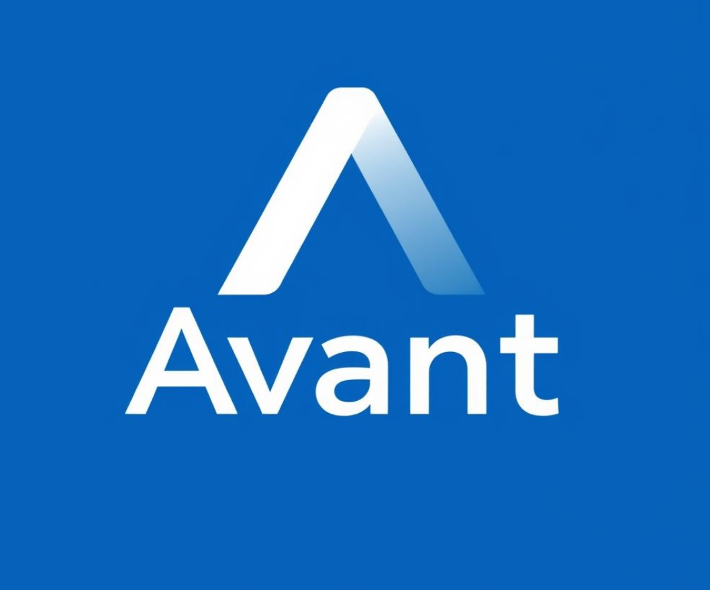
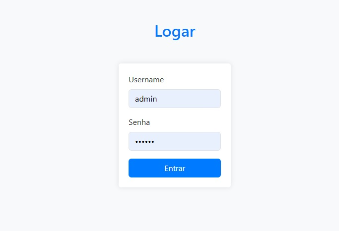
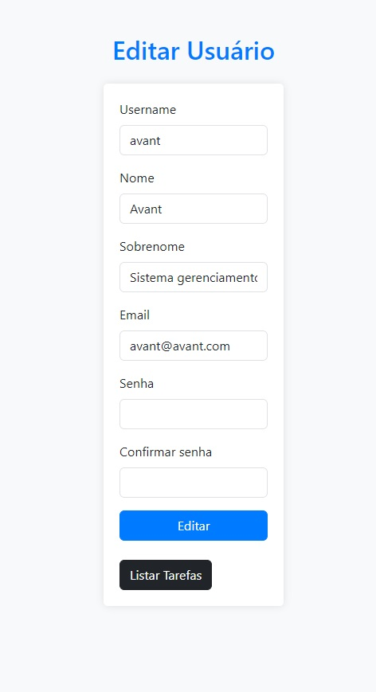
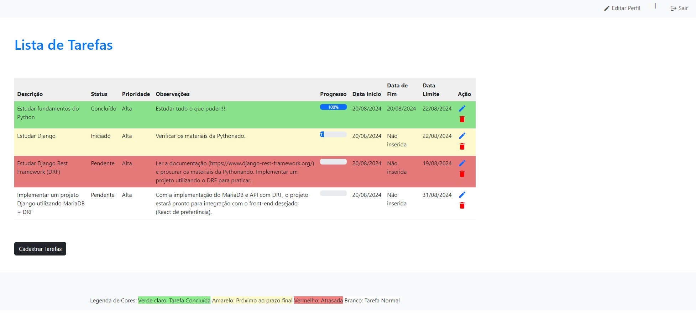
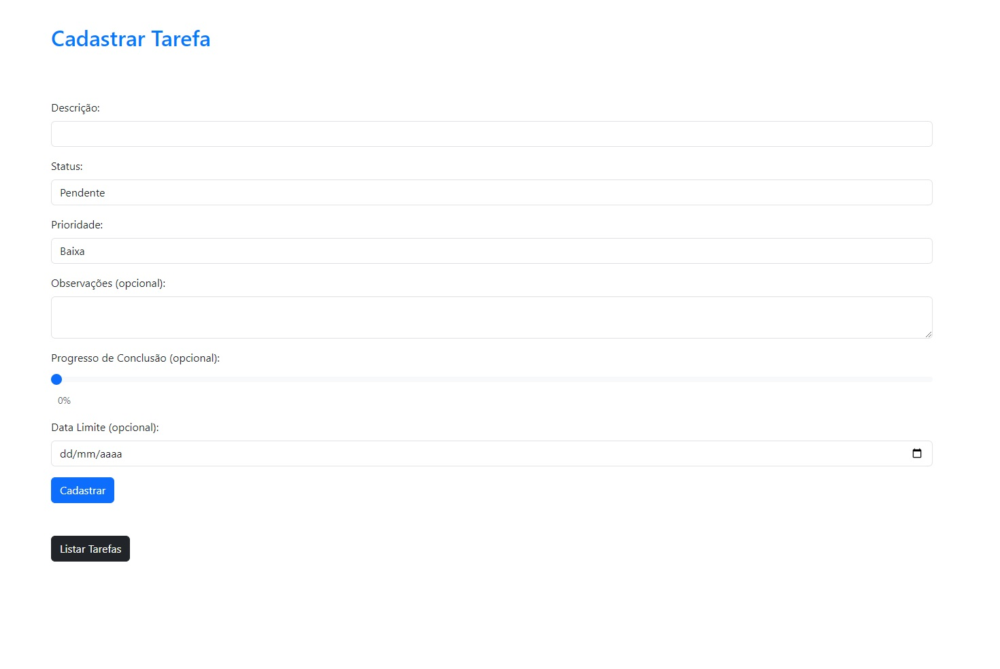

<div align="center" style="padding-top: 20px;">
  
# Projeto Django Avant

## Este projeto é um exemplo de aplicação web construída com Django para gerenciar tarefas.

</div>


<div align="center" style="padding-bottom: 40px; padding-top: 20px">
        
</div>

## Índice
- [Funcionalidades](#funcionalidades)
- [Tecnologias Utilizadas](#tecnologias-utilizadas)
- [Como Executar o Projeto](#como-executar-o-projeto)
- [Observações](#observações)
- [Dependências](#dependências)
- [Estrutura do Repositório](#estrutura-do-repositório)
- [Telas de exemplo do projeto](#telas-de-exemplo-do-projeto)

## Funcionalidades

- **Cadastro de usuários**
- **Gerenciamento de sessão dos usuários** (autenticação Django)
- **Sistema de autenticação de usuários**
- **Edição dos dados do usuário**
- **Criação de novas tarefas**
- **Listagem de tarefas**
- **Edição de tarefas**
- **Exclusão de tarefas**

## Tecnologias Utilizadas

- **Python 3.x**
- **Django 5.x**
- **SQLite**
- **Bootstrap 5**
- **Material UI (Ícones)**
- **Git & GitHub**

## Como Executar o Projeto

1. **Clone o repositório**  
   Este projeto não possui um repositório específico, ele está dentro de um repositório geral do curso.

2. **Crie um ambiente virtual**
   ```bash
   python3 -m venv env
   source env/bin/activate

3. **Instale as dependências**
 ```bash
 pip install -r requirements.txt
  ```

4. **Configure as configurações do banco de dados**  
    Configure as configurações do banco de dados no arquivo settings.py.

5. **Crie as tabelas do banco de dados**
   ```bash
    python manage.py makemigrations
    python manage.py migrate

6. **Inicie o servidor**
    ```bash
    python manage.py runserver

7. **Acesse a aplicação**  
   Abra o seu navegador e acesse: http://127.0.0.1:8000/tarefas/

## Observações

- Este projeto é um exemplo simples para fins de estudo.
- É importante implementar medidas de segurança adicionais para proteger os dados dos usuários em um ambiente real.
- Adapte o projeto de acordo com as suas necessidades e requisitos.

## Dependências

- `asgiref==3.8.1`: Framework ASGI para Django.
- `Django==5.1`: Framework Django para desenvolvimento web.
- `django-dump-die==0.1.7`: Ferramenta para debugging.
- `sqlparse==0.5.1`: Ferramenta para formatação e análise de SQL.
- `typing_extensions==4.12.2`: Extensões para o módulo typing.

## Estrutura do Repositório
```plaintext
Proj_Mod.1_2/
├── README.md
├── db.sqlite3
├── requirements.txt
├── manage.py
├── Info
├── core/
├── usuarios/
├── tarefas/
├── media/
├── templates/
└── venv/
```

## Telas de exemplo do projeto
<table align="center">
  <tr>
    <td>
      <a href="Info/imgSys/Login.jpg" target="_blank">
        
      </a>
    </td>
    <td>
      <a href="Info/imgSys/Editar_user.jpg" target="_blank">
        
      </a>
    </td>
  </tr>
  <tr>
    <td>
      <a href="Info/imgSys/listar_tarefas.jpg" target="_blank">
        
      </a>
    </td>
    <td>
      <a href="Info/imgSys/Cadastrar_tarefa.jpg" target="_blank">
        
      </a>
    </td>
  </tr>
</table>